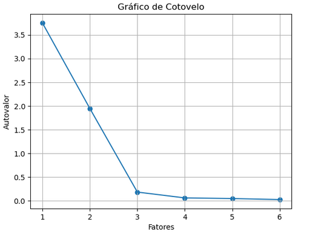
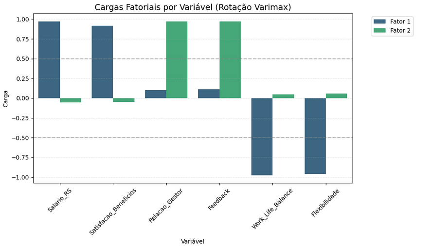

# 📊 Análise Fatorial: Identificando Estruturas Latentes no RH

Este projeto aplica técnicas de **Estatística Multivariada** para entender os pilares invisíveis que moldam a satisfação e o comportamento dos colaboradores em uma organização. Utilizei a **Análise Fatorial Exploratória (AFE)** para reduzir a complexidade de múltiplos indicadores em dimensões estratégicas.

## 🎯 Objetivo
Transformar variáveis mensuráveis (Salário, Notas de Feedback, Flexibilidade, etc.) em **Fatores Latentes**, permitindo que o RH foque em planos de ação estruturais em vez de métricas isoladas.

---

## 🛠️ Pipeline de Ciência de Dados

### 1. Preparação e Rigor Estatístico
Diferente de modelos de Machine Learning comuns, a Análise Fatorial exige pressupostos rígidos:
* **Padronização (Z-Score):** Utilizei `StandardScaler` para equilibrar variáveis de escalas distintas (ex: Salários em Reais vs. Notas de 1 a 10).
* **Teste de Bartlett:** Confirmou que a matriz de correlação não é uma identidade ($p < 0.05$).
* **KMO (Kaiser-Meyer-Olkin):** Validou a adequação da amostragem para fatoração.

### 2. Definição da Estrutura (Scree Plot)
Utilizei o critério de **Autovalores (Eigenvalues) > 1** e a análise visual do gráfico de cotovelo (*Scree Plot*) para definir a retenção de **2 fatores principais**, garantindo a parcimônia do modelo.

---

## 📈 Interpretação dos Fatores (Insights de Negócio)

Após a aplicação da rotação **Varimax**, os dados revelaram dois eixos fundamentais:

| Fator | Nome Proposto | Descrição do Insight |
| :--- | :--- | :--- |
| **Fator 1** | **Eixo Recompensa vs. Liberdade** | Revela um *trade-off* onde altos salários estão inversamente ligados à flexibilidade e equilíbrio de vida. |
| **Fator 2** | **Eixo Cultura de Liderança** | Agrupa a qualidade da relação com o gestor e a clareza do feedback, independente do nível salarial. |

### Visualização das Cargas Fatoriais
O gráfico abaixo demonstra a força de cada variável em seu respectivo fator:

---

## 🧪 Tecnologias e Bibliotecas
* **Python 3.x**
* **Pandas & Numpy**: Manipulação de dados.
* **Factor-Analyzer**: Execução da análise fatorial e testes de adequação.
* **Scikit-Learn**: Pré-processamento e padronização.
* **Seaborn & Matplotlib**: Visualização de dados estatísticos.

---

## 💡 Conclusão
A análise mostrou que a satisfação não é um bloco único. O RH pode, por exemplo, melhorar a retenção através do **Fator 2 (Liderança)** com treinamentos, mesmo em cenários onde o **Fator 1 (Financeiro)** esteja limitado por restrições orçamentárias.

---
**Desenvolvido por Douglas Vittori**  
Estudante de Gestão de TI | Focado em Análise de Dados e Modelagem Estatística
